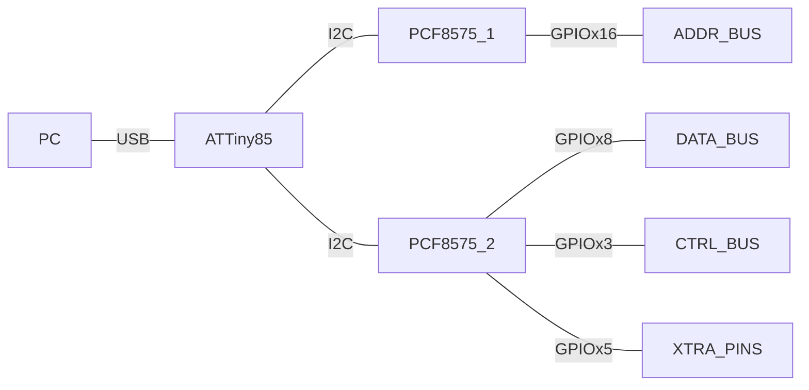

## EEPROM Burner

### Hardware Used
  - ATTiny85 (x1)   => 8 pin $\mu C$ from Microchip Atmel
- PCF8575 (x2)      => I2C to 16 pin I/O expander
- SMD LEDs (x4)     => chip_enable, write_enable, read_enable, power 
- Headers
  - Address Bus : 16 Pins (x2)
  - Data Bus : 8 Pins (x2)
  - Control Bus : 3 Pins (x2)
  - Additional Pins : 5 Pins (x2)

  
### Software Used

  - [Micronucleus USB Bootloader](https://github.com/micronucleus/micronucleus)
  - [I2C-Tiny-USB on Digispark](https://github.com/harbaum/I2C-Tiny-USB/blob/master/digispark/README.md)
  - [KonarkNV EEPROM Driver](https://github.com/konarknv/z80/tree/main/tools/eeprom_burner)

### Design

